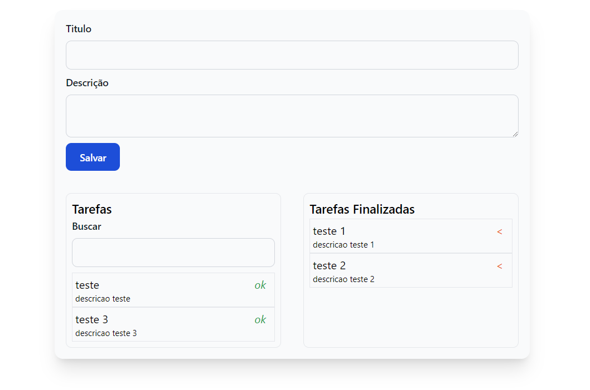

## Minicurso Expotec - App Tarefas

## Sobre
Projeto desenvolvido durante o minicurso ministrado por mim na **[IX expotec](https://eventos.ifrn.edu.br/expotecnc/2023/home)** do **Instituto Federal de Educação, Ciência e Tecnologia do Rio Grande do Norte** com intuito de uma breve apresentação do **[Laravel](https://laravel.com)** e **[Livewire](https://livewire.laravel.com/)**. A aplicação consiste em uma lista de tarefas onde o usuário poderá cadastrar, buscar uma tarefa ativa, marcar como concluida e restaurar uma tarefa.



## Instalação

- Clone o projeto utilizando
    ```
        git clone https://github.com/thiagomeloo/minicurso-expotec.git
    ```
- Crie o arquivo ```.env``` copiando de ```.env.example```

- Execute o comando para instalar as dependências do vendor
    ```
        docker run --rm \
        -u "$(id -u):$(id -g)" \
        -v "$(pwd):/var/www/html" \
        -w /var/www/html \
        laravelsail/php82-composer:latest \
        composer install --ignore-platform-reqs
    ```
- Execute as migrations 
    ```
        ./vendor/bin/sail php artisan migrate
    ```
- Instale as depedências JS com o comando
    ```
        ./vendor/bin/sail npm install
    ```
- Inicie o sail com o comando
    ```
        ./vendor/bin/sail up
    ```
- Execute o seguinte comando para fazer build dos assets
    ```
        ./vendor/bin/sail npm run dev
    ```
A partir de agora seu projeto está disponível no endereço ```http://localhost```

